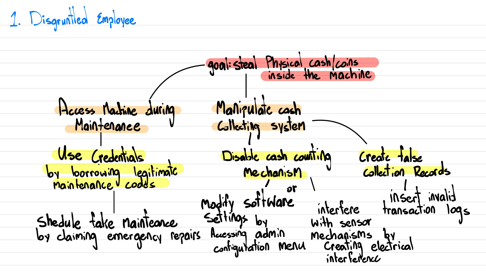
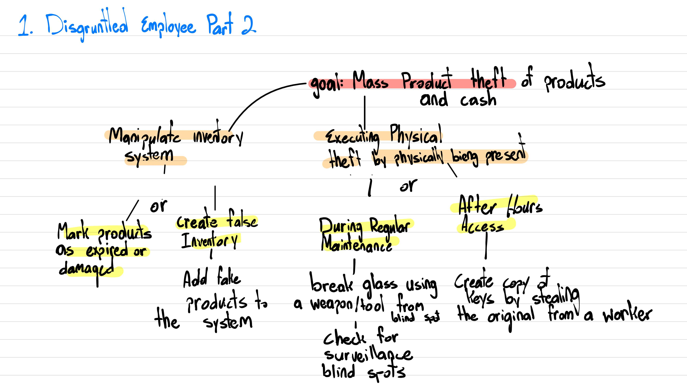
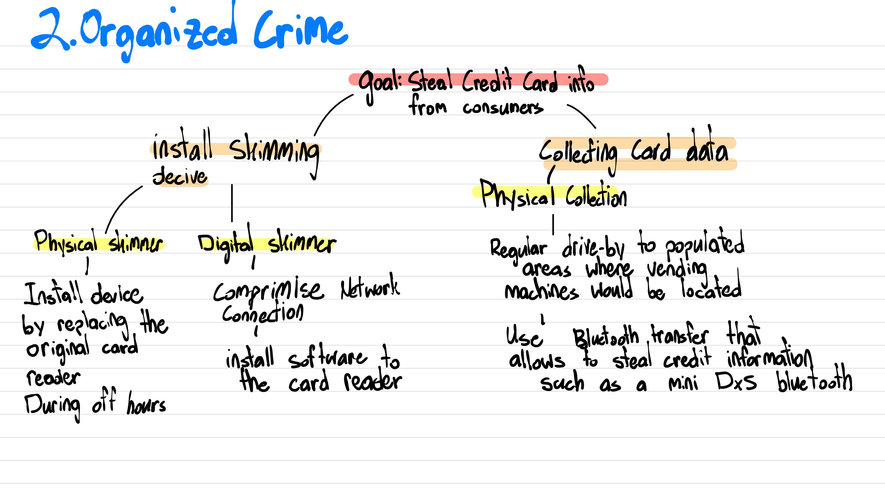
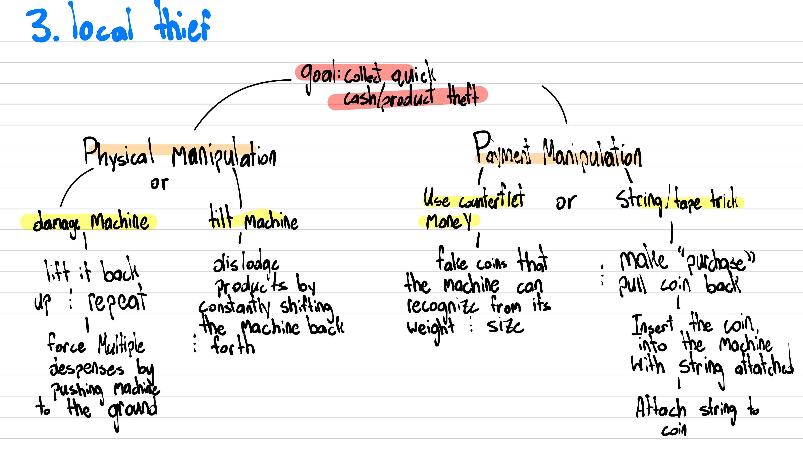
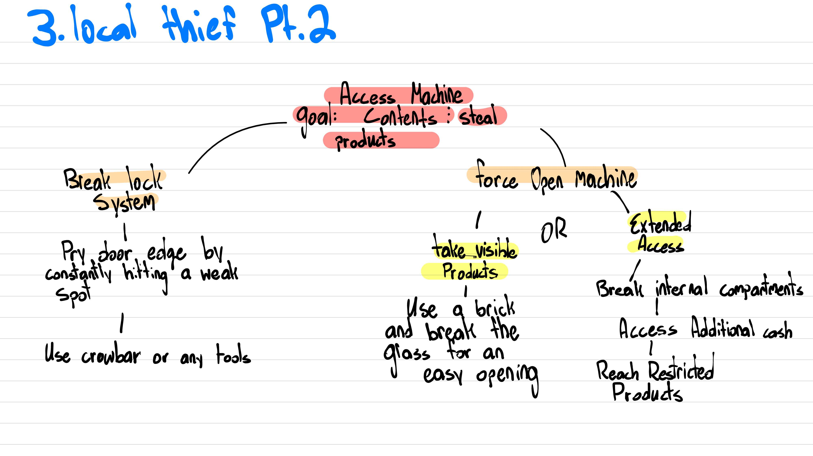

# Threat Assessment of Vending Machines

 Group 9       |
|------------|
| Erik Cruz Martinez   |
| Ethan Grant Holland   |
| Matthew Shawn Templeton |
| Ngan Huynh   |
| Phu Hoang   |

# 1. System Description
- ### What was the system? 
	- The system consists of the vending machines on UTK campus.
- ### Who is supposed to use the system?
	- Any one who may visit, work, or attend school on this campus.
- ### What are their tasks? (Does the tasks need to be the human interacting physically with the machine?)
	1. **DECIDE PAYMENT METHOD:** They decide on a payment method (Meal plans/credit/debit cards/cash)
	2. **PAY:** They pay with the chosen method  
		- Insert cash bills and/or coins for cash payments.  
		- Insert, swipe, or tap cards for physical card payments.  
		- Tap a phone for meal plans or other contactless payments  
			  (e.g., digital wallets such as Apple Pay, Samsung Pay, Google Pay, etc.).
	3. **ENTER ITEM CODE:** They enter a item code (A1/A2.../E9/...) from the keypad (Letters for rows, numbers for columns)
		- If the code is valid and the item is in stock, the machine dispenses the product shortly.
		- If the code is invalid or the item is out of stock, the machine prompts them to enter a new code or asks if they want to cancel the transaction.		
	4. **RECEIVE ITEM:** They retrieve the dispensed product
		- If the product cannot be dispensed, they may leave or call the number displayed on the payment area to contact the managing team for assistance.
	5. **RECIEVE CHANGE (optional):** If it was a cash payment, they wait for the change.
	6. **CONFIRM FOR A RECEIPT:** They answer *yes* or *no* to print a receipt
		- If *yes*, they wait for the receipt.
	7. **CONFIRM ANOTHER TRANSACTION:** They answer *yes* or *no* to the question:  
	   **"Do you want to purchase another item?"**
	    - If they choose to buy more, they repeat all the steps above.
	
- ### What are their goals?
	- Purchasing item(s) from the vending machines  
	- Using secure payment methods  
	- Completing successful payment processing  
	- Retrieving dispensed item(s) successfully  
	- Getting a refund if the item cannot be dispensed  
	- Ensuring the transaction is fully closed before leaving

# 2. Diagrams

- ### User Workflow Diagram
  
![[user-workflow-diagram.png]](user-workflow-diagram.png)

- ### Data Flow Diagram

![[data-flow-diagram.png]](data-flow-diagram.png)

# 3. Asset analysis

- ### What assets exists in this system?

	- **Control Board**: Manages the system to execute operations like processing payments, releasing products, tracking inventory, and handling errors.

	- **Communication Module**: Facilitates the secure and efficient exchange of data between system components.
	
	- **Inventory Sensors**: Track stock levels in real-time and automatically update inventory data.
	
	- **Credit Reader**: Allows the machine to communicate with the payment system.
	
	- **Bill Validator**: Verifies the authenticity of bills using optical sensors to analyze their features.
	
	- **Coin Mechanism**: Identifies, classifies, and validates inserted coins using light sensors.
	
	- **Vending Lock**: Prevents unauthorized access to the vending inventory and cash.
	
	- **Vending Motor**: Delivers products by moving them from the storage area to the dispensing area.
	
	- **Refrigerator**: Maintains the desired storage temperature for products, essential for food items.
	
	- **Dispensing Tray**: Holds products in place to prevent them from falling to the bottom of the vending machine.
	
	- **Products**: Drinks and/or food inside the vending machine.
	
	- **Cash and Coins**: Currency stored within the machine.
	
	- **Data**: Includes credit card information and system records.

- ### What assets are most valuable?

	#### Based on Price:
	
	- **Refrigerator**: $800
	
	- **Control Board**: $500
	
	- **Communication Module**: $200
	
	- **Bill Validator**: $300
	
	- **Credit Reader**: $200
	
	- **Product**: Value escalates quickly.
	
	- **Cash and Coins**: Value escalates quickly.
	
	- **Data**: Loss of income due to inaccurate system records.
	
	#### Based on Risk:
		
	- **Control Board**: Risk of leaking confidential data and loss of income.
	
	- **Credit Reader**: Risk of leaking sensitive data.
	
	- **Bill Validator**: Risk of loss of income due to invalid bills.
	
	- **Data**: Risk of harming reputation, lawsuits, compensation, and loss of income.

# 4. Adversary analysis
## Adversary Overview
- This report analyzes adversaries targeting vending machine systems by examining their objectives, methodologies, and capabilities.
- They are classified into two types:
  - **Internal Threat**: Represents a significant risk to vending machine security since they have privileged access and knowledge about the system.
  - **External Threat**: These attackers are unfamiliar with the system, but their capabilities are varied and unpredictable.

## Adversary Profiles

#### 1. Disgruntled Employees
#### Objectives
Attackers like these seek to cause financial harm to the company, steal products/cash, or disrupt operations.
#### Methods
- Distributing sensitive information to external parties for a share of the profits
- Compromising inventory tracking mechanisms to reach their objective
#### Capacities
Their position provides advantages such as:
- Valid system credentials and access rights
- Knowledge of system vulnerabilities (either physical or within the software)
- Knowledge of operational schedules

#### 2. High-tech Criminals
#### Objectives
These groups focus on large-scale theft of cash or products. They may also install malware for broader network access (though this is rare).
#### Methods
- Physical break-ins, such as breaking the glass with a tool
- Network attacks if the machine is connected to a network
- Social engineering of maintenance staff who may have access to sensitive information
#### Capacities
- Technical skills that could allow for either physical break-ins or network access
- Experience with similar attacks they may have conducted before

#### 3. Malicious Students
#### Objectives
Their goals focus on immediate gains through the following:
- Physical stealing
- Cash extraction (this can occur with any type of vending machine)
- Quick, opportunistic attacks
#### Methods
Their approach typically involves:
- Using counterfeit currency to avoid paying for the product
- Tool-based attacks to break the glass of the vending machine
#### Capacities
- Access to basic tools such as hammers, rocks, etc.
- Individual or small group operations
- Rapid attack execution
- Knowledge of how to avoid detection and surveillance cameras

# 5. Attack trees

## 1. Disgruntled Employees

## 2. Organized Criminal Groups

## 3. Local Thieves

# 6. Defender analysis
- ### Who is trying to defend the system?
- The primary party trying to defend the system is the owner and operator of the vending machine.
- Other significant parties involved in its defense would be the campus administration and payment processors.

- ### What resources do they have access to?

#### Machine Operator
- The machine's operator likely has access to physical security measures on the machine, such as a strong casing for the machine itself and locks to keep its contents secure.
- They also likely have access to a transaction log, tracking purchases made with both physical and digital payment methods, ideally helping them notice and prevent unusual activity.
- The operator likely has some sort of alarm or alert system in place so that they would be alerted if the machine were compromised physically or digitally.

#### University Administration
- The university has security cameras all across campus, ideally catching or deterring anyone acting against a vending machine.
- The university also has access to appropriate physical response in the form of security and campus police to deter and apprehend anyone who may be at fault.
- In the case of a digital attack, the university has access to its information security team to ideally deter and catch those at fault.

#### Payment Processors
- Payment processors serve as a form of protection for the users of the vending machine in case their payment information is stolen, an example of this would be a payment skimmer.
- Payment processors can block fraudulent payments, ideally protecting the user and owner of the vending machine.
- If fraudulent activity is not identified until after the transaction, payment processors can work to reimburse customers.

# 7. Risk analysis

## **Threat #1: A disgruntled employee steals cash and coins inside the machine during a maintenance shift**

| **Score** | **Factor**         | **Explanation**                                      |
|-----------|--------------------|------------------------------------------------------|
| 8         | **Damage Potential** | - Adversary can take all cash and coins inside the machine    - Many machines can be attacked    - Affects cash-back function |
| 8         | **Reproducibility**  | - Works on all types of machines    - Depends on the schedule of the attacker |
| 8         | **Exploitability**   | - Anyone from the maintenance team can do it |
| 8         | **Affected Users**   | - Machine owners    - Buyers need cash-back |
| 10        | **Discoverability**  | - It is easy to realize the vulnerability of trust |

- **Risk evaluation:** **8.4 / 10**  

---

## **Threat #2: A disgruntled employee steals selling products inside the machine using a duplicated key**

| **Score** | **Factor**         | **Explanation**                                      |
|-----------|--------------------|------------------------------------------------------|
| 10        | **Damage Potential** | - The adversary can take all selling products inside the machine    - Many machines can be attacked    - Reputation damage    - Affected locks need to be replaced |
| 5         | **Reproducibility**  | - One key works for one type of machines    - Depends on the schedule of the attacker    - Depends on the quality of the duplicated key |
| 4         | **Exploitability**   | - Must be on the maintenance team    - Requires access to the original key    - Depends on the key type (electronic, biometric…)    - Requires a perfect duplicate of the key |
| 7         | **Affected Users**   | - Machine owners |
| 4         | **Discoverability**  | - It is not easy to notice the vulnerability of key duplicating |

- **Risk evaluation:** **6 / 10**  

---

## **Threat #3: A high-tech criminal steals credit card info by installing a skimming device on top of the card reader**

| **Score** | **Factor**           | **Explanation**                                                                                                                                                                              |
| --------- | -------------------- | -------------------------------------------------------------------------------------------------------------------------------------------------------------------------------------------- |
| 10        | **Damage Potential** | - Massive financial damage   - Reputation damage                                                                                                                                          |
| 6         | **Reproducibility**  | - One device can fit one type of vending machine   - Requires careful examination of the machine before installing                                                                        |
| 3         | **Exploitability**   | - Attackers are experts in computer science and electrical engineering   - The device needs to be perfectly created to fit   - Even harder or impossible to install on modern machines |
| 8         | **Affected Users**   | - Buyers using cards   - Machine owners also involved in the responsibility                                                                                                               |
| 4         | **Discoverability**  | - Requires knowledge and experience to figure out this vulnerability                                                                                                                         |

- **Risk evaluation:** **6.2 / 10**  

---

## **Threat #4: A malicious student physically steals selling products by tilting the machine**

| **Score** | **Factor**           | **Explanation**                                                                        |
| --------- | -------------------- | -------------------------------------------------------------------------------------- |
| 7         | **Damage Potential** | - Some products may be lost   - Physical damage to the machine                      |
| 3         | **Reproducibility**  | - The number of stolen products varies   - The physical damage varies               |
| 3         | **Exploitability**   | - A vending machine is extremely heavy to be tilted   - Avoid attention and cameras |
| 7         | **Affected Users**   | - Machine owner                                                                        |
| 10        | **Discoverability**  | - Anyone can come up with this idea                                                    |

- **Risk evaluation:** **5.6 / 10**  

---

## **Threat #5: A malicious student physically steals the contents of the machine by prying the door**

| **Score** | **Factor**           | **Explanation**                                                                                                                                               |
| --------- | -------------------- | ------------------------------------------------------------------------------------------------------------------------------------------------------------- |
| 9         | **Damage Potential** | - All the contents (products, cash, and coins) are lost   - The door lock is destroyed   - Reputation is badly harmed                                   |
| 2         | **Reproducibility**  | - Depends on the time, location, and environment   - Some locks are too tough to pry                                                                       |
| 3         | **Exploitability**   | - Requires great strength   - Avoid attention and cameras   - Must prepare a firm and appropriate tool   - Can be interrupted if triggering an alert |
| 7         | **Affected Users**   | - Machine owner                                                                                                                                               |
| 8         | **Discoverability**  | - Easy to come up with this idea                                                                                                                              |

- **Risk evaluation:** **5.8 / 10**  

# 8. Mitigations
## Proposed Mitigations
We propose the following three mitigations to lower the risk of attacks on vending machines.
### 1. Implement Strong Authentication and Encryption
- Require secure authentication for service techs and administrative users.
- Encrypt communication between the machine and backend servers to prevent interception of payment data.
- **DREAD updates:** **Damage (↓), Exploitability (↓), Affected Users (↓)**
### 2. Harden Physical Security
- Reinforce locks, sensors, and glass to prevent unauthorized physical access.
- Implement a **safe-fault mechanism** if tampering is detected.
- **DREAD updates:** **Damage (↓), Exploitability (↓)**
### 3. Regular Patching and Monitoring
- Update firmware regularly to fix vulnerabilities.
- Implement anomaly detection (e.g., suspicious transactions or break-in attempts).
- **DREAD updates:** **Reproducibility (↓), Exploitability (↓)**

| Threat                                                      | Damage (D) | Reproducibility (R) | Exploitability (E) | Affected Users (A) | Discoverability (D) | Risk Score (Avg)      | Updated Factors                                         |
| ----------------------------------------------------------- | ---------- | ------------------- | ------------------ | ------------------ | ------------------- | --------------------- | ------------------------------------------------------- |
| **Threat #1: Employee steals cash/coins**                   | **7** (↓)  | **8**               | **6** (↓)          | **7** (↓)          | **10**              | **7.6** (was **8.4**) | Damage, Exploitability, Affected Users                  |
| **Threat #2: Employee steals products using duplicate key** | **9** (↓)  | **5**               | **3** (↓)          | **7**              | **4**               | **5.6** (was **6.0**) | Damage, Exploitability                                  |
| **Threat #3: Skimming device steals credit card data**      | **8** (↓)  | **5** (↓)           | **2** (↓)          | **7** (↓)          | **4**               | **5.2** (was **6.2**) | Damage, Reproducibility, Exploitability, Affected Users |
| **Threat #4: Student tilts machine to steal products**      | **6** (↓)  | **3**               | **2** (↓)          | **7**              | **10**              | **5.6** (unchanged)   | Damage, Exploitability                                  |
| **Threat #5: Student pries open door to steal contents**    | **8** (↓)  | **2**               | **2** (↓)          | **7**              | **8**               | **5.4** (was **5.8**) | Damage, Exploitability                                  |

# 9. Reflect

> This evaluation enlightened us about the many moving parts of defending something as commonplace as a vending machine. We learned of the multiple lines and varying types of defenses used to protect the machine. This evaluation also highlighted the numerous motivations and variety of groups that may potentially target a vending machine. Even though it may seem like a relatively insignificant object in our everyday lives, there are still many parties that possess the motivation and knowledge to facilitate an attack of some sort, even if this ranges from a physical attack from a disgruntled student seeking revenge or from a more technically savvy party seeking greater financial gain.

> This evaluation impacted how we think of security as it fully demonstrates that security is not a battle fought on one front. There are multiple lines of defense in place to protect relevant parties. We see this in the fact that the vending machine has physical protections and deterrents in the form of locks, alarms, and strengthened casings. Still, there is another line of defense, which is digital, as we assume that the operator of the vending machine has access to remote surveillance in the form of alerts and transaction logs. Behind this, there is another form of protection: if either of the prior two fails, the user may be protected. We see this in the form of payment processors and university administration. These parties ensure that no actual harm is done, that it can be minimized, and that those responsible will be punished.

> This evaluation of a vending machine’s security has shown that security is not an afterthought; even in something as seemingly trivial as a vending machine, something so unimportant in everyday life still has several lines of defense in different forms. It fully demonstrated that security is not an optional benefit afforded to more sensitive or essential items; it is necessary.