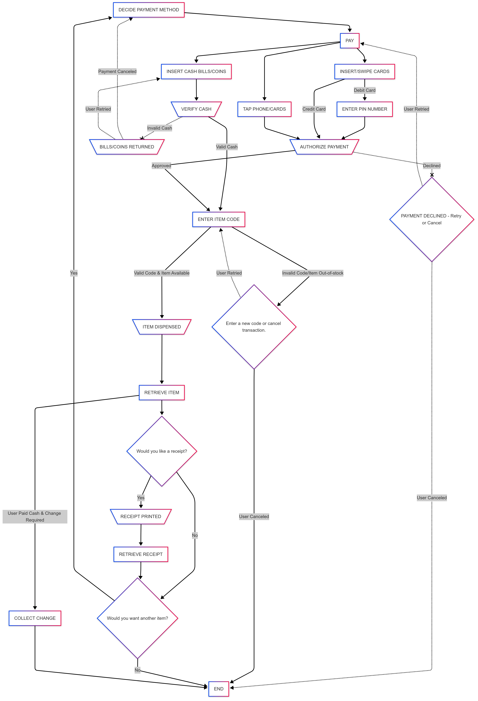

- ### What was the system? 
	- The system consists of the vending machines on UTK campus.
- ### Who is supposed to use the system?
	- Any one who may visit, work, or attend school on this campus.
- ### What are their tasks? (Does the tasks need to be the human interacting physically with the machine?)
	1. **DECIDE PAYMENT METHOD:** They decide on a payment method (Meal plans/credit/debit cards/cash)
	2. **PAY:** They pay with the chosen method  
		   a. Insert cash bills and/or coins for cash payments.  
		   b. Insert, swipe, or tap cards for physical card payments.  
		   c. Tap a phone for meal plans or other contactless payments  
			  (e.g., digital wallets such as Apple Pay, Samsung Pay, Google Pay, etc.).
	3. **ENTER ITEM CODE:** They enter a item code (A1/A2.../E9/...) from the keypad (Letters for rows, numbers for columns).
		a. If the code is valid and the item is in stock, the machine dispenses the product shortly.
		b. If the code is invalid or the item is out of stock, the machine prompts them to enter a new code or asks if they want to cancel the transaction.		
	4. **RECEIVE ITEM:** They retrieve the dispensed product.
		   a. If the product cannot be dispensed, they may leave or call the number displayed on the payment area to contact the managing team for assistance.
	5. **RECIEVE CHANGE (optional):** If it was a cash payment, they wait for the change.
	6. **CONFIRM FOR A RECEIPT:** They answer *yes* or *no* to print a receipt.
		   a. If *yes*, they wait for the receipt.
	7. **CONFIRM ANOTHER TRANSACTION:** They answer *yes* or *no* to the question:  
	   **"Do you want to purchase another item?"**
	8. **CONTINUE BUYING MORE ITEMS (optional):** If they choose to buy more, they repeat all the steps above.
	
- ### What are their goals?
	- Purchasing item(s) from the vending machines  
	- Using secure payment methods  
	- Completing successful payment processing  
	- Retrieving dispensed item(s) successfully  
	- Getting a refund if the item cannot be dispensed  
	- Ensuring the transaction is fully closed before leaving

- ### Diagrams
#### 1. USER WORKFLOW DIAGRAM

#### 2. DATA FLOW DIAGRAM

